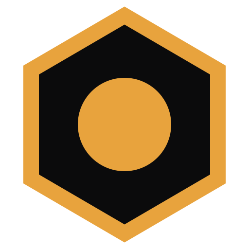

#  Varroa

Varroa is a Kubernetes-native operator for managing Jenkins controllers at scale.
It provides single sign-on, Git-backed configuration, and fleet observability.

[](https://github.com/varroaci/varroa-jenkins/actions/workflows/pr.yaml)

- **Multi-cluster from one control plane.** Controllers run on remote clusters under one dashboard and one RBAC model.
- **Air-gapped by design.** An in-cluster Jenkins update center serves digest-verified plugins from OCI storage without egress.
- **Git and OCI as configuration sources.** JCasC is composed from ordered inputs rather than copied per controller.
- **Fleet operations.** Restart, upgrade, or run a script across a brood in staged waves with a canary.

## Adoption path

The same `Controller` resource describes one Jenkins and five hundred. Each row
below is optional and independent. Adopting one does not require the next.

| Situation | Resource |
|---|---|
| First controller | None. `kubectl apply` a `Controller` and it uses the built-in starter bundle. |
| A team wants its own config | A [`ComposedBundle`](docs/config/composed-bundles.md) pointed at their git repo. |
| Several teams, one baseline | [Catalog items](docs/config/casc-catalog.md), shared fragments composed in order. |
| Many controllers, same shape | A [`ControllerClass`](docs/config/controller-classes.md). |
| Deliberate upgrades | [`JenkinsVersionProfile`](docs/config/jenkins-versions.md), a pinned core plus plugin lock. |
| Changes that must land safely | [Rollout waves](docs/operations/rollout-waves.md). |
| No egress allowed | The [update center](docs/install/air-gapped.md). |
| More than one cluster | [Multi-cluster](docs/install/multi-cluster.md). |
| AI agents driving the platform | The [MCP endpoint](docs/agents/overview.md), which exposes fleet and Jenkins tools under one identity. |

## What Varroa does

Varroa manages the full lifecycle of Jenkins controllers. You define a `Controller`
custom resource, and Varroa provisions a StatefulSet running Jenkins with a **mite**
sidecar agent. The mite connects back to the gateway over gRPC with mTLS.

The operator publishes desired-state commands through NATS, and the gateway delivers
them to the mite. Those commands carry JCasC configuration, plugin manifests, and RBAC
policies. When the desired state diverges from the mite's reported snapshot, the
operator publishes an update.

### Authentication

Authentication uses any RFC-compliant OIDC provider, including Auth0, Okta, Azure AD,
Keycloak, and Google. Varroa issues a `varroa_token` cookie on a shared parent domain
so every Jenkins controller sees it. For identity providers that do not speak OIDC
natively, such as GitHub OAuth, LDAP, and SAML, Varroa can deploy Dex as a federation
broker to translate between protocols.

The **VarroaSecurityRealm** plugin validates the JWT and maps OIDC group claims to
Jenkins roles. Unauthenticated users are redirected to Varroa's login page, so no
per-controller redirect URIs are required.

The mite sidecar holds no Jenkins credentials at rest. The operator signs an RS256 JWT
and pushes it to the mite over the command stream. The VarroaSecurityRealm plugin
verifies that token offline against the operator's public key. There are no API tokens
and no init scripts. See the [mite documentation](docs/architecture/mite.md).

For non-browser callers, [Varroa API keys](docs/security/api-keys.md) are one credential
for the whole platform. A `vk_` bearer token authenticates against the Varroa API, the
MCP endpoint, and any Jenkins controller directly. The VarroaSecurityRealm validates
`vk_` bearers against the gateway, and Jenkins sees the key's owner as the authenticated
user under normal role-strategy authorization. There are no per-controller Jenkins
tokens to manage.

## AI agents

One MCP endpoint at `https://<dashboard-host>/api/v1/mcp` covers both halves of the
lifecycle. It takes a Varroa API key over `Authorization: Bearer`, and `varroactl mcp`
bridges stdio clients.

- **Controller lifecycle.** Fleet tools for controllers, composed bundles, catalogs,
  version profiles, users, groups, RBAC, and activity history. An agent can inspect a
  wedged controller, fix its bundle, and watch it reconcile without leaving MCP.
- **Job lifecycle.** `call_jenkins_tool` forwards MCP requests into the `mcp-server`
  plugin of any controller in the core cluster. That plugin is pinned in every Varroa
  core plugin set, so the same session reaches jobs, builds, and queues inside each
  Jenkins.

The bridge never forwards your API key. Each call mints a five-minute Jenkins token
scoped to exactly one controller, carrying the caller's own identity and groups. Jenkins
sees the real user, applies its normal role-strategy authorization, and every action is
attributable. See [agent identity](docs/agents/identity.md).

## Architecture

```
Browser → Ingress → Frontend → BFF HTTP API/SSE → Kubernetes API + NATS read models
                                  │
                                  └── OIDC provider login (Dex optional) and varroa_token cookie

Controller CRDs → Operator reconciler → NATS JetStream/KV → Gateway → gRPC mTLS → mite
                      │                                      │                  │
                      └── Kubernetes provisioning            └── live streams   └── Jenkins API

Observability: Prometheus-format metrics on every service (bring your own stack)
```

The mite sidecar runs in every Jenkins pod. It registers with the gateway using a
bootstrap HMAC token, receives an mTLS client certificate from the internal CA, and
opens a long-lived bidirectional `CommandStream`. The gateway bridges stream traffic to
NATS. The operator owns reconciliation and desired-state publication, and the BFF owns
the frontend-facing HTTP API and read models.

## Installation

> **New to Varroa?** Start with the [Operator Handbook](docs/README.md). The
> [first-controller tutorial](docs/tutorials/first-controller.md) walks from zero to a
> running, managed Jenkins.

Varroa is deployed with Helm. To evaluate it you need a Kubernetes cluster on v1.30 or
later with a default StorageClass. To run it for other people you also need
`cert-manager` for TLS, a domain name, and an identity provider.
[Prerequisites](docs/install/prerequisites.md) splits the two.

```bash
helm install varroa oci://ghcr.io/varroaci/charts/varroa --version 0.1.0 \
  --namespace varroa-system \
  --create-namespace \
  --values values.yaml
```

Choose the minimal `values.yaml` that fits your identity provider.

<details>
<summary><b>Option A: direct OIDC</b> (Auth0, Okta, Azure AD, Keycloak, Google)</summary>

```yaml
global:
  domain: your-domain.com

dex:
  enabled: false

auth:
  mode: oidc
  cookieDomain: .your-domain.com
  dashboardUrl: https://app.your-domain.com
  oidc:
    issuer: https://dev-xxx.us.auth0.com/
    clientId: <oidc-client-id>
    clientSecret: <oidc-client-secret>
    redirectUrl: https://app.your-domain.com/callback

ingress:
  enabled: true
  className: nginx
  annotations:
    cert-manager.io/cluster-issuer: letsencrypt-route53
  tls:
    - hosts: [app.your-domain.com]
      secretName: varroa-tls
```
</details>

<details>
<summary><b>Option B: Dex as federation broker</b> (GitHub OAuth, LDAP, SAML)</summary>

```yaml
global:
  domain: your-domain.com

dex:
  enabled: true
  config:
    issuer: https://dex.your-domain.com
    connectors:
      - type: github
        id: github
        name: GitHub
        config:
          clientID: $GITHUB_CLIENT_ID
          clientSecret: $GITHUB_CLIENT_SECRET
          orgs:
            - name: your-github-org
          loadAllGroups: true
          claims:
            groups: ["groups"]

ingress:
  enabled: true
  className: nginx
  annotations:
    cert-manager.io/cluster-issuer: letsencrypt-route53
  tls:
    - hosts: [app.your-domain.com, dex.your-domain.com]
      secretName: varroa-tls
```
</details>

See [Installing with Helm](docs/install/helm-install.md) for full configuration details.
[Authentication](docs/security/authentication.md) covers all four auth modes: direct
OIDC, Dex-brokered, native LDAP, and local.

### ProvisioningDefaults

Set cluster-wide defaults before creating controllers.

```yaml
apiVersion: varroa.dev/v1alpha1
kind: ProvisioningDefaults
metadata:
  name: varroa-defaults
spec:
  storageClass: openebs-hostpath
  ingressClassName: nginx
  imagePullSecrets:
    - ghcr-credentials
  ingressAnnotations:
    cert-manager.io/cluster-issuer: letsencrypt-route53
```

## Quickstart

This is the smallest controller Varroa accepts.

```yaml
apiVersion: varroa.dev/v1alpha1
kind: Controller
metadata:
  name: demo
  namespace: varroa
spec:
  namespace: varroa
```

It names no bundle and no version. It uses the starter bundle the operator ships, which
provides a system message, a Kubernetes cloud so builds get agents, and one sample
pipeline. It runs the Jenkins core that matches Varroa's embedded plugin lock. With no
ingress host configured it is reachable through `kubectl port-forward`, and its status
says so. See the [first-controller tutorial](docs/tutorials/first-controller.md) and
[examples/](examples/) for more starting points, including OIDC values and an air-gapped
setup.

Once you want your own configuration, name a bundle and pin a version.

```yaml
apiVersion: varroa.dev/v1alpha1
kind: ComposedBundle
metadata:
  name: standard
  namespace: varroa-tenants
spec:
  inputs:
    - gitSource:
        repoURL: https://github.com/your-org/jcasc-bundles.git
        path: bundles/standard
        revision: main
---
apiVersion: varroa.dev/v1alpha1
kind: Controller
metadata:
  name: team-web-builds
  namespace: varroa-tenants
spec:
  namespace: varroa-tenants
  version: "2.555"                 # governed by JenkinsVersionProfile objects
  composedBundleRef:
    name: standard
  ingressSpec:
    host: builds.team-web.your-domain.com
    tlsSecretName: team-web-builds-tls
  persistence:
    size: 20Gi
```

Apply it.

```bash
kubectl apply -f controller.yaml
kubectl get controllers -n varroa-tenants
```

The controller moves through the phases `Pending`, `Provisioning`, `Running`, and
`Connected`. Controllers are created declaratively through `kubectl apply` or your
GitOps tool. The REST API and dashboard cover lifecycle operations on existing
controllers, such as restart, reprovision, and approval, plus the read models behind
the UI.

## CRDs

| Resource | Scope | Purpose |
|----------|-------|---------|
| [`Controller`](docs/operations/lifecycle.md) | Namespaced | A managed Jenkins instance. |
| [`ComposedBundle`](docs/config/composed-bundles.md) | Namespaced | Ordered composition of JCasC inputs into one bundle. |
| [`CatalogSource`](docs/config/casc-catalog.md) | Namespaced | Git-synced source of reusable catalog items. |
| [`CatalogItem`](docs/config/casc-catalog.md) | Namespaced | One reusable, parameterized config snippet, owned by the operator. |
| [`JenkinsVersionProfile`](docs/config/jenkins-versions.md) | Cluster | Pinned plugin set and JCasC overlay per Jenkins version or LTS line. |
| [`ProvisioningDefaults`](docs/install/helm-install.md) | Cluster | Brood defaults for storage, ingress, plugins, namespaces, and presets. |
| [`ControllerClass`](docs/config/controller-classes.md) | Cluster | Reusable controller shape that many controllers inherit. |
| [`UpdateCenter`](docs/operations/update-center.md) | Cluster | In-cluster Jenkins update center for air-gapped plugin delivery. |
| [`BroodOperation`](docs/operations/brood-operations.md) | Namespaced | One fleet operation (restart, upgrade, script) across selected controllers. |
| [`BroodSchedule`](docs/operations/brood-schedules.md) | Namespaced | Recurring schedule that stamps out BroodOperations. |
| [`VarroaRole`](docs/security/varroa-rbac.md) / [`VarroaRoleBinding`](docs/security/varroa-rbac.md) | Cluster | Control-plane authorization for the API and dashboard. |
| [`JenkinsRole`](docs/security/jenkins-rbac.md) / [`JenkinsRoleBinding`](docs/security/jenkins-rbac.md) | Cluster | In-Jenkins permissions, generated into role strategy. |
| [`Team`](docs/operations/multi-tenancy.md) | Cluster | Tenant team with namespaces and scoped RBAC. |
| [`Group`](docs/security/varroa-rbac.md) | Cluster | Identity group used by RBAC subjects. |
| [`User`](docs/security/authentication.md) | Namespaced | Local-auth user record. |
| [`PodTemplate`](docs/config/pod-customization.md) | Namespaced | Kubernetes pod template for Jenkins agents. |
| [`BuildMetric`](docs/operations/observability.md) | Namespaced | Per-build metrics collected by the mite. |

## Auth model

Varroa replaces Jenkins' native authentication entirely.

1. **User login.** The browser redirects to `https://app.your-domain.com/login`. Varroa's
   OIDC handler redirects to the OIDC provider, or to Dex first when Dex brokers GitHub
   OAuth, LDAP, or SAML.
2. **JWT issuance.** The OIDC provider issues an ID token with email, name, and group
   claims.
3. **Cookie.** Varroa sets `varroa_token` as a domain cookie on `.your-domain.com`, so
   every Jenkins controller at `*.your-domain.com` receives it.
4. **VarroaSecurityRealm.** The Jenkins plugin validates the JWT against the OIDC
   provider's JWKS endpoint and creates a Jenkins authentication with group authorities.
5. **Mite auth.** The mite presents an operator-signed RS256 JWT as a bearer token. The
   VarroaSecurityRealm verifies it offline against the operator's public key, with no Dex
   or network dependency, and grants the mite's minimal role.

There are no shared secrets and no CSRF workarounds. The auth plugin lives in this repo
under [`plugin/`](plugin/) and is delivered into each Jenkins by an init container. See
[Authentication](docs/security/authentication.md).

## RBAC model

Authorization is split into two layers, both declared as cluster-scoped CRDs.

- **[Varroa RBAC](docs/security/varroa-rbac.md).** `VarroaRole` and `VarroaRoleBinding`
  govern the dashboard and REST API. The built-in roles are `admin`, `operator`,
  `developer`, and `viewer`.
- **[Jenkins RBAC](docs/security/jenkins-rbac.md).** `JenkinsRole` and
  `JenkinsRoleBinding` govern permissions inside each Jenkins and are generated into the
  role-strategy config. Varroa owns the authorization strategy, and bundles cannot
  override it.

```yaml
apiVersion: varroa.dev/v1alpha1
kind: VarroaRoleBinding
metadata:
  name: platform-operators
spec:
  roleRef: operator
  subjects:
    - kind: Group
      name: "acme:platform-team"
```

Bindings scope to namespaces and controller label selectors. Jenkins-side bindings also
scope to folders or item-name patterns.

See [Plugin pinning](docs/config/plugin-pinning.md) for plugin governance and
[Multi-tenancy](docs/operations/multi-tenancy.md) for brood and team management.

## Observability

Varroa exports Prometheus metrics from all services. The operator and gateway serve them
on `:9091`, and the BFF and the opt-in update center serve them on their API ports. All
are token-protected through `METRICS_TOKEN`. Alongside the standard controller-runtime
and Go runtime series, Varroa adds its own gauges such as
`varroa_controller_mite_image_stale`.

The Helm chart ships no monitoring stack. Point your own Prometheus at the metrics
endpoints. When NetworkPolicies are enabled, `networkPolicy.metricsIngress` admits
external scrapers. A JetStream-backed activity feed narrates every brood event. See
[Observability](docs/operations/observability.md).

## Development

### Prerequisites

| Tool    | Version | Check |
|---------|---------|-------|
| Go      | 1.26+   | `go version` |
| Node.js | 20+     | `node --version` |
| kubectl | 1.30+   | `kubectl version --client` |
| Helm    | 3.17+   | `helm version` |
| Kind    | 0.27+   | `kind version` |
| Docker  | 26.0+   | `docker version` |

### Local development cluster

```bash
make localdev        # full stack on a disposable kind cluster, browser-ready
make localdev-images # rebuild + roll after code changes
make localdev-down   # tear down
```

One command stands up the operator, gateway, BFF, frontend, NATS, HTTPS ingress, and a
sample Jenkins controller at `https://app.varroa.localtest.me`. Sign in with `admin` and
`password` through the built-in local auth.

### Backend

```bash
make build          # bin/varroa-operator, bin/varroa-gateway, bin/varroa-bff, bin/varroa-mite, bin/varroa-updatecenter
make build-cli      # bin/varroactl (see docs/varroactl.md)
make test           # all Go tests with race detector
make lint           # golangci-lint
make generate-crds  # regenerate CRD YAML from Go type markers
```

The split backend components are `varroa-operator` for reconciliation,
`varroa-gateway` for the mite gRPC service on `:9090`, and `varroa-bff` for the HTTP API
on `:8080`.

### Frontend

```bash
cd frontend && npm ci && npm run dev   # Vite at :3000
```

Set `VITE_VARROA_BFF_URL=http://localhost:8080/api/v1` in `frontend/.env`.

### Project structure

See [AGENTS.md](AGENTS.md) for the working map of the codebase, and
[docs/architecture/](docs/architecture/) for the controller lifecycle, mite protocol,
and component deep-dives.

## Contributing

Issues and pull requests are welcome. See the open issues for areas to contribute. The
operator and mite are written in Go, and the auth plugin is a Jenkins HPI under
[`plugin/`](plugin/).

All contributions must be signed off under the
[Developer Certificate of Origin](https://developercertificate.org/) using
`git commit -s`.

## License

Varroa is licensed under the [GNU Affero General Public License v3.0](LICENSE). You are
free to use, modify, and self-host Varroa. If you offer a modified version of Varroa to
others over a network, the AGPL requires you to make your modified source available to
those users.
