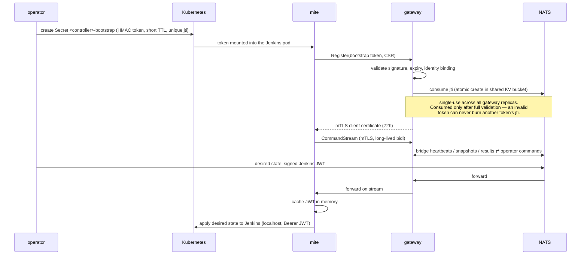

# The mite

<!-- sources: cmd/mite/agent.go, internal/mite/server.go, internal/mite/proto/mitev1/mite.proto, internal/mite/jenkinstoken.go, internal/mite/consumed_token.go, internal/ca/ca.go, internal/controller/controller_controller.go (bootstrap secret), plugin/ -->

The mite is Varroa's per-controller agent: a small sidecar container in every Jenkins pod. It is the **only** component that talks to Jenkins on Varroa's behalf — the control plane never reaches into a Jenkins directly. Understanding the mite explains most of how Varroa applies configuration, detects drift, and reports health.

## Concepts

### What the mite does

- **Registers** with the gateway using a one-time bootstrap token and receives an mTLS client certificate.
- **Streams** — holds one long-lived bidirectional gRPC stream (`CommandStream`) to the gateway, over which everything else flows.
- **Heartbeats** every 15 seconds, carrying health and a state snapshot summary.
- **Snapshots** — reports the observed Jenkins state (version, plugins, config fingerprints) so the operator can detect drift.
- **Applies desired state** — receives commands from the operator (JCasC apply, plugin operations, restarts, RBAC updates) and executes them against Jenkins over localhost REST, returning structured results.
- **Drains before termination** — on pod shutdown it coordinates a graceful build drain (see below).

### Identity and the handshake

This page owns the authoritative statement of the mite handshake; other pages link here rather than restating it.



1. **Bootstrap**: when provisioning a controller, the operator writes a Secret named `<controller>-bootstrap` containing a short-lived HMAC-signed token with a unique identifier (`jti`). The token is bound to the controller's identity (`name.namespace`).
2. **Register**: the mite calls the gateway's `Register` RPC with the token. The gateway validates signature, expiry, and identity **first**, and only then consumes the `jti` — recorded in a NATS JetStream KV bucket shared by all gateway replicas with atomic create-only writes, so a token is single-use brood-wide, across replicas and gateway restarts. Consuming only after validation means an attacker presenting a corrupted token cannot invalidate a legitimate one.
3. **Certificate**: on successful registration the internal CA issues the mite an mTLS client certificate with CN `<controller>.<namespace>`, valid for **72 hours**.
4. **Stream**: the mite opens `CommandStream`, a long-lived bidirectional gRPC stream authenticated by that certificate. The gateway bridges the stream to NATS; the operator publishes commands and consumes results without holding any connection to the pod.

### Certificate renewal

The mite renews proactively: a background loop checks every 10 minutes and requests a new certificate once **7/10 of the certificate lifetime** has elapsed (~50 hours into the 72), using its existing keypair over the authenticated channel. If a certificate has fully expired (e.g. the pod was suspended), the mite attempts renewal with its existing keypair before falling back to requiring a fresh bootstrap.

### How the mite authenticates to Jenkins

The mite holds **no Jenkins credentials at rest**. The operator signs an RS256 JWT (audience: the target Jenkins) and pushes it to the mite over the command stream; the mite caches it in memory only, and presents it as a `Bearer` token on localhost REST calls. The in-repo **VarroaSecurityRealm** plugin (source under `plugin/`, baked into the image and delivered by an init container) verifies the JWT offline against the operator's public key — no callback to the control plane, no Dex dependency, no API tokens, and no init-Groovy user creation.

The mite operates with **minimal Jenkins permissions**: it makes zero `ADMINISTER`-level calls. Configuration is applied through the Configuration-as-Code endpoints, plugin installs happen out-of-band of the Jenkins UI mechanisms, and restarts are performed at the Kubernetes level.

### Termination drain

Rolling a Jenkins pod mid-build loses work, so shutdown is coordinated:

- On `SIGTERM`, the mite runs a termination drain (quiet-down semantics bounded by the controller's `drainTimeoutSeconds`, see [Reconciliation](../operations/reconciliation.md)).
- When the drain completes it writes a **drain-done marker file** shared with the Jenkins container; the Jenkins container's `preStop` hook polls for that marker and only then lets Jenkins exit. A failure to write the marker is logged but never wedges the pod — the preStop times out rather than hanging indefinitely.

### Connection resilience (why the stream stays up)

- The mite pings the gateway every 30 seconds; the gateway's keepalive enforcement allows pings no more frequent than every 15 seconds. These two numbers are paired deliberately — a client pinging faster than the server's floor is disconnected with `GOAWAY ENHANCE_YOUR_CALM` (see [Troubleshooting](../operations/troubleshooting.md)).
- Sends from the heartbeat loop and the command executor are serialized internally; a send failure closes the connection to unblock the receive loop, and the mite reconnects with exponential backoff (capped at 2 minutes).
- Commands carry a deadline (default 20 minutes, tunable brood-wide via `ProvisioningDefaults.commandDeadlineSec`), so a stuck apply can't block the stream forever.

## How to observe a mite

Check registration and stream state from the controller's status:

```bash
kubectl get controller <name> -n <namespace> -o jsonpath='{.status.phase}'
# Connected  ← mite registered and streaming
kubectl get controller <name> -n <namespace> -o jsonpath='{.status.mite}' | jq .
```

Read the mite's own logs (it is the `mite` container in the Jenkins pod):

```bash
kubectl logs sts/<name> -n <namespace> -c mite --tail=50
```

**Verify:** the log shows a successful `Register` followed by `CommandStream established`, and heartbeat sends every ~15s; `status.phase` is `Connected`.

## Troubleshooting

- Controller stuck in `Running`, never `Connected` → bootstrap token consumed or expired; see [Troubleshooting](../operations/troubleshooting.md#mite-disconnected).
- Stream drops with `ENHANCE_YOUR_CALM` → keepalive mismatch (custom builds only; shipped defaults are paired correctly).
- Mite gets `401/403` from Jenkins → JWT not yet pushed (operator just restarted) or security-realm plugin not loaded; see [Troubleshooting](../operations/troubleshooting.md).

## Related pages

- [Architecture overview](overview.md) — where the mite sits in the component map
- [Reconciliation](../operations/reconciliation.md) — how desired state reaches the mite, and when
- [Lifecycle](../operations/lifecycle.md) — restarts, drains, power state
- [Network policies](../install/network-policies.md) — the mite→gateway flow to allow
