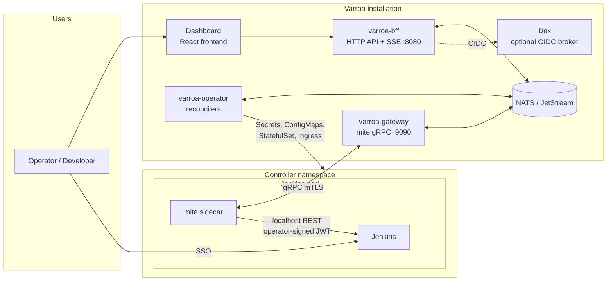
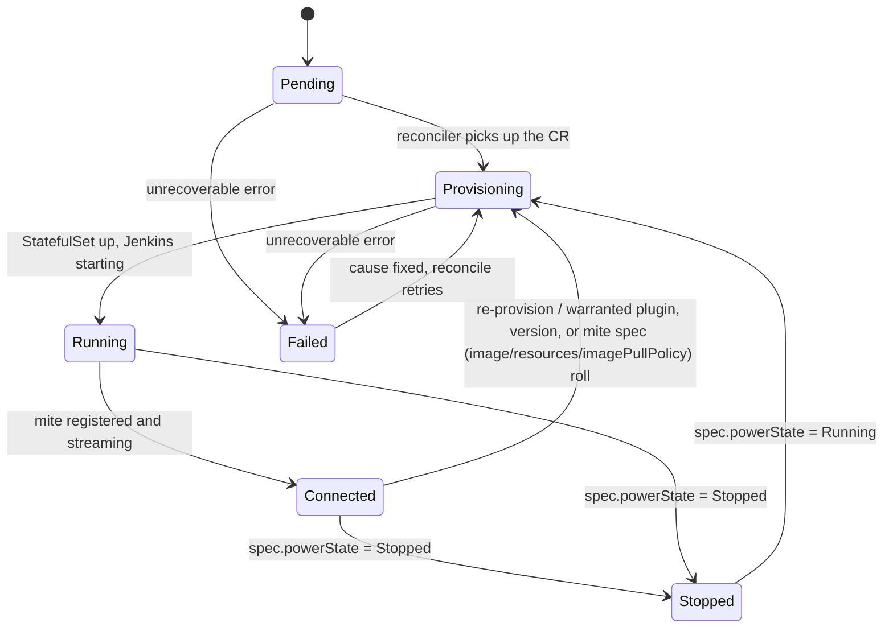

# Architecture Overview

<!-- sources: CLAUDE.md, cmd/operator/main.go, cmd/gateway/main.go, cmd/bff/main.go, cmd/mite/agent.go, api/v1alpha1/types.go, charts/varroa/values.yaml, charts/varroa/crds/ -->

This page gives you the mental model for everything else in the handbook: what the Varroa components are, which custom resources you'll work with, and how a Jenkins controller moves through its lifecycle.

## Concepts

Varroa manages **broods of Jenkins controllers** on Kubernetes. You declare what a controller should look like — version, plugins, Configuration-as-Code, RBAC — and Varroa provisions it, keeps it converged, and gives you one dashboard and API for the whole brood.

Terminology used consistently across this handbook:

| Term | Meaning |
|---|---|
| **Control plane** | The backend components: operator, gateway, BFF, and the NATS bus |
| **Dashboard** | The React frontend UI, deployed with the control plane |
| **Varroa installation** | Everything the Helm chart deploys that isn't a managed Jenkins instance: control plane + dashboard + optional Dex and observability stack |
| **Controller** | A managed Jenkins instance (a `Controller` custom resource and the StatefulSet behind it). Distinct from Kubernetes controllers; in this handbook "controller" always means the Jenkins kind |
| **mite** | The sidecar agent running in every Jenkins pod, connected to the gateway over gRPC mTLS |
| **Bundle** | The composed Configuration-as-Code (JCasC) content a controller runs with |

### Component map

- **varroa-operator** (`cmd/operator`) runs the controller-runtime reconcilers for all Varroa CRDs. It builds each controller's Kubernetes resources (StatefulSet, Services, Ingress, ConfigMaps, Secrets), composes bundles, generates RBAC, and publishes desired state to the bus. Replicas are leader-elected: one active reconciler, the rest hot standbys (see [Scaling](scaling.md)).
- **varroa-gateway** (`cmd/gateway`) terminates mite gRPC connections on `:9090` (mTLS). It bridges mite heartbeats, state snapshots, and command results to the bus, and forwards operator commands down each mite's stream. Stateless and horizontally scalable.
- **varroa-bff** (`cmd/bff`) serves the HTTP API and Server-Sent Events on `:8080` for the dashboard and API clients. It authenticates users (local, OIDC, or LDAP — see [Authentication](../security/authentication.md)), enforces [Varroa RBAC](../security/varroa-rbac.md), and reads/writes the CRDs. Stateless and horizontally scalable.
- **NATS / JetStream** is the message bus between the three backend components: desired-state publications, mite command bridging, the activity stream, and shared key-value state (e.g. the consumed bootstrap-token store). TLS with per-service credentials and ACLs.
  - **Cluster identity:** every NATS subject and KV key is qualified by `VARROA_CLUSTER_NAME` (`cluster.name`, default `core`). Scheme summary: `mite.<cluster>.<ns>.<name>.*` (in/out/content), `events.brood.<cluster>`, `activity.<cluster>.<ns>.<ctrl>` / `activity.<cluster>._global`, `operator.<cluster>.<action>`, KV `<cluster>/<ns>/<name>`. Brood and activity payloads carry a `cluster` field.
- **The mite** rides in every Jenkins pod and is the only thing that talks to Jenkins on Varroa's behalf. See [The mite](mite.md).
- **Dex** is an optional OIDC broker for identity providers that don't speak OIDC directly (GitHub OAuth, upstream LDAP, SAML).
- **VarroaSecurityRealm plugin** (in-repo under `plugin/`, delivered into each Jenkins by an init container) authenticates dashboard users via OIDC JWTs and the mite via operator-signed JWTs — verified offline, with no runtime dependency on Dex.

## Reference: custom resources

All CRDs are in API group `varroa.dev/v1alpha1`. Namespaced unless marked cluster-scoped.

| Kind | Scope | Purpose | Handbook page |
|---|---|---|---|
| `Controller` | Namespaced | A managed Jenkins instance: version, bundle ref, plugins, resources, ingress, reconciliation policy | [Lifecycle](../operations/lifecycle.md) |
| `ComposedBundle` | Namespaced | Ordered composition of JCasC inputs (catalog items and/or git sources) into one bundle | [Composed bundles](../config/composed-bundles.md) |
| `CatalogSource` | Namespaced | A synced source of catalog items (git-backed) | [CasC catalog](../config/casc-catalog.md) |
| `CatalogItem` | Namespaced | One reusable JCasC snippet with variables and an optional plugins block | [CasC catalog](../config/casc-catalog.md) |
| `JenkinsVersionProfile` | Cluster | Pins a plugin set + JCasC overlay + catalog metadata to a Jenkins version or LTS line | [Jenkins versions](../config/jenkins-versions.md) |
| `ControllerClass` | Cluster | Layers cluster-level defaults between ProvisioningDefaults and each Controller via spec.className | [Controller classes](../config/controller-classes.md) |
| `ProvisioningDefaults` | Cluster | Brood-wide defaults: domains, resources, plugins, namespaces, size presets, reconciliation defaults | [Helm install](../install/helm-install.md), [Lifecycle](../operations/lifecycle.md) |
| `VarroaRole` | Cluster | A Varroa API/dashboard role: built-ins plus custom API rules | [Varroa RBAC](../security/varroa-rbac.md) |
| `VarroaRoleBinding` | Cluster | Binds subjects (users/groups) to a `VarroaRole`, optionally scoped | [Varroa RBAC](../security/varroa-rbac.md) |
| `JenkinsRole` | Cluster | A pure Jenkins permission set (Global/Item/Agent) | [Jenkins RBAC](../security/jenkins-rbac.md) |
| `JenkinsRoleBinding` | Cluster | Assigns Jenkins roles to subjects, optionally scoped to controllers/folders | [Jenkins RBAC](../security/jenkins-rbac.md) |
| `Team` | Cluster | A tenant team: provisions and isolates team namespaces | [Multi-tenancy](../operations/multi-tenancy.md) |
| `Group` | Cluster | An identity group definition used by RBAC subjects | [Varroa RBAC](../security/varroa-rbac.md) |
| `User` | Namespaced | A local Varroa user (local auth mode) with preferences and credentials | [Authentication](../security/authentication.md) |
| `PodTemplate` | Namespaced | A reusable Jenkins agent pod template | [Pod customization](../config/pod-customization.md) |
| `BuildMetric` | Namespaced | Recorded build metrics for brood insights | [Observability](../operations/observability.md) |

## Concepts: controller lifecycle

A `Controller` moves through phases surfaced in `status.phase`:

- **Pending** — the CR exists; reconciliation hasn't started.
- **Provisioning** — the operator is building resources: init ConfigMaps, the StatefulSet, agent RBAC, ingress; the bundle is composed and validated.
- **Running** — the pod is up and Jenkins is starting; the mite hasn't connected yet.
- **Connected** — the mite is registered and its command stream is live; steady-state convergence runs on the reconciliation interval. This is the healthy state.
- **Stopped** — `spec.powerState: Stopped` scaled the StatefulSet to zero. Setting it back to `Running` brings the controller back up through Provisioning → Running → Connected.
- **Failed** — an unrecoverable error occurred; see `status.conditions` and [Troubleshooting](../operations/troubleshooting.md).

How configuration flows from your git repo or catalog into a running Jenkins is described in [Composed bundles](../config/composed-bundles.md) (composition) and [The mite](mite.md) (delivery).

## Related pages

- [The mite](mite.md) — the agent that makes `Connected` happen
- [Scaling](scaling.md) — which components scale and how
- [Your first controller](../tutorials/first-controller.md) — see the lifecycle end to end
- [Reconciliation](../operations/reconciliation.md) — what happens each tick in `Connected`
- [Troubleshooting](../operations/troubleshooting.md) — when a phase won't advance
