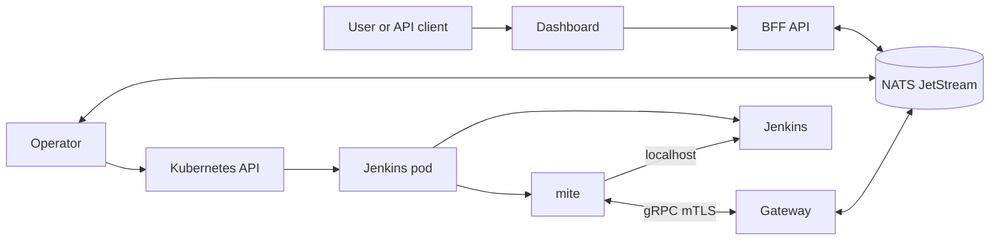

# Architecture Overview

Varroa manages Jenkins controllers as Kubernetes resources. One namespaced `Controller` creates one Jenkins StatefulSet, Service, persistent volume, mite sidecar, and optional Ingress.

## Control Plane



| Component | Function |
|---|---|
| Operator | Provisions Jenkins resources. |
| Gateway | Terminates mite mTLS. |
| BFF | Serves APIs and activity. |
| Dashboard | Provides the browser client. |
| NATS JetStream | Carries messages and shared state. Components re-read their bus credential on every reconnect, so a rotated password needs no restart. |
| mite | Observes and configures Jenkins. |
| Dex | Brokers identity into OIDC. |
| Update center | Serves pinned plugins. |

Only the dashboard, BFF, and Jenkins routes need external HTTP access. The gateway remains a cluster-internal Service. The mite initiates its connection, so the control plane does not require inbound access to Jenkins.

## Controller Configuration

Varroa resolves a controller from installation defaults, an optional `ControllerClass`, and the `Controller` spec. The controller spec has the highest precedence.

Jenkins configuration comes from a `ComposedBundle`. Its ordered inputs can reference catalog items, Git repositories, or OCI artifacts. An omitted `spec.composedBundleRef` selects the built-in `varroa-starter` bundle. A `JenkinsVersionProfile` supplies the compatible plugin set and any version-specific JCasC overlay. `JenkinsRole` and `JenkinsRoleBinding` resources define Jenkins authorization.

See [Composed bundles](../config/composed-bundles.md), [Jenkins versions](../config/jenkins-versions.md), and [Jenkins RBAC](../security/jenkins-rbac.md).

## Lifecycle

Read `status.phase` and `status.conditions` when operating a controller.

| Phase | Meaning |
|---|---|
| `Pending` | Waiting for reconciliation. |
| `Provisioning` | Resolving configuration or creating Kubernetes resources. |
| `Running` | Jenkins is running, but the mite stream is not ready. |
| `Connected` | The mite stream is active. This is the normal steady state. |
| `Stopped` | `spec.powerState: Stopped` scaled the StatefulSet to zero. |
| `Hibernated` | Inactivity policy parked the controller. |
| `Failed` | A blocking provisioning or operation error occurred. |

A phase says where the controller is in its lifecycle. It does not say whether the controller is stuck there. Varroa reports "needs attention" separately, on the dashboard, the controllers list, and the detail page. It is derived from these status signals, in precedence order.

| Signal | Shown as | Meaning |
|---|---|---|
| `status.phase: Failed` | Failed | A blocking provisioning or operation error. See the `Failed` condition. |
| `ReconcileBlocked` condition | Blocked | The operator cannot proceed. The bundle is unreadable, or a plugin pin conflicts with the version-profile lock. The message names the fix. |
| `JenkinsBootFailed` condition | Boot failed | The Jenkins container is crash-looping, or its image cannot be pulled. The message carries the exit code and restart count. Read the container logs. |
| `PluginRollFailed` condition | Plugin roll failed | The `plugins-init` step failed. |
| `status.lastApplyResult.succeeded: false` | Apply failed | The mite could not apply the last desired state. |

`status.lastReconciledAt` advances on every reconcile pass that completes without error, in every phase. Read the attention signal first, not this timestamp. Most wedged controllers still reconcile cleanly and so keep a fresh stamp: a Boot failed, Plugin roll failed, or Apply failed controller records the problem in its status and the pass still succeeds. The stamp goes stale only for a Blocked controller, whose pass ends in an error, and during a `Failed` phase dwell. Use `lastReconciledAt` for one distinction: a stale value with no attention signal means the operator is not reconciling this controller at all, rather than reconciling it and being blocked.

Reloadable configuration can apply without replacing the pod. Changes to plugins, images, or other restart-class settings can return the controller to `Provisioning` while Varroa rolls it.

```bash
kubectl get controller <name> -n <namespace>
kubectl describe controller <name> -n <namespace>
```

Use [Troubleshooting](../operations/troubleshooting.md) when a controller does not reach `Connected`.

## Core Resources

All resources use `varroa.dev/v1alpha1`.

| Resource | Scope | Purpose |
|---|---|---|
| `Controller` | Namespaced | Declares one Jenkins controller. |
| `ComposedBundle`, `CatalogSource`, `CatalogItem` | Namespaced | Supply Jenkins configuration. |
| `PodTemplate` | Namespaced | Defines reusable Kubernetes agents. |
| `ProvisioningDefaults`, `ControllerClass` | Cluster | Supply reusable controller defaults. |
| `JenkinsVersionProfile` | Cluster | Pins Jenkins and plugin compatibility. |
| `VarroaRole`, `VarroaRoleBinding` | Cluster | Authorize dashboard and API actions. |
| `JenkinsRole`, `JenkinsRoleBinding` | Cluster | Authorize actions inside Jenkins. |
| `UpdateCenter` | Cluster | Declares the optional plugin service. |

Continue with [The mite](mite.md), [Scaling](scaling.md), or [Your first controller](../tutorials/first-controller.md).
