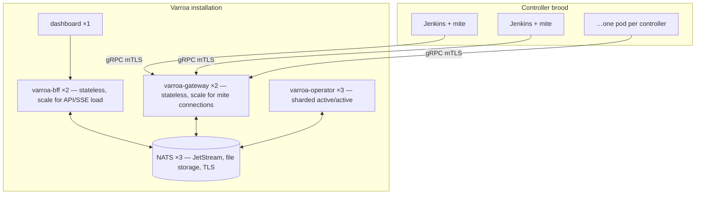

# Scaling

<!-- sources: charts/varroa/values.yaml, cmd/operator/main.go (leader election), cmd/operator/runnables.go, internal/controller/sharding/ring.go (unwired, roadmap), internal/bundle/ (cache), api/v1alpha1/types.go (ProvisioningDefaultsSpec, SizePreset) -->

This page explains which parts of a Varroa installation scale, how, and which levers you actually have. Numbers shown are the chart defaults from `charts/varroa/values.yaml`.

## Concepts

### Topology and levers



| Component | Default | Scaling model | When to add replicas |
|---|---|---|---|
| `bff.replicas` | 2 | Stateless, active/active | More dashboard users, API clients, or SSE subscribers |
| `gateway.replicas` | 2 | Stateless, active/active | More connected mites (larger brood) |
| `operator.replicas` | 3 | **Sharded, active/active (per-shard Leases)** | More controllers / reconcile throughput; also failover |
| `nats.config.cluster.replicas` (with `nats.config.cluster.enabled: true`) | 3 | NATS cluster, JetStream file storage | Rarely; storage/durability driven — see [NATS JetStream replication](../install/helm-install.md#nats-jetstream-replication) |
| `frontend.replicas` | 1 | Stateless | Static assets; rarely needed |

### The operator is active/active (sharded)

Operator replicas divide Controller CR reconciliation using per-shard Kubernetes Leases. Each replica runs the Controller reconciler (registered with `NeedLeaderElection=false`) and a `ShardManager` that claims shard Leases:

- **Presence leases** (`varroa-replica-<pod>.varroa.dev`, 30s TTL) let every replica discover which peers are alive.
- **Shard ownership leases** (`varroa-shard-<n>.varroa.dev`, n ∈ 0..shardCount−1) are claimed by one replica at a time; the apiserver's `resourceVersion` CAS is the mutual-exclusion primitive.
- `Ring.Assign` distributes N shards across M live replicas via round-robin over a sorted replica list — deterministic, fair (sizes differ by ≤1), converges in ≤2 passes.

When a shard is acquired, the `ShardManager` calls `Reconciler.EnqueueShards` to re-enqueue every Controller CR whose key hashes to the newly owned shard. Non-owned CRs are skipped at the top of `Reconcile` (requeue-free).

**Handoff timing:** graceful shutdown ≈10s (one rebalance interval); crash ≤ leaseDuration + interval (~40s). The safety invariant is strict: `held` membership brackets lease possession — two replicas cannot hold the same shard lease concurrently (CAS), so no CR has two concurrent reconciling owners.

The `varroa-operator.varroa.dev` leader lease still gates:
- Auxiliary reconciler runnables (catalog, version profiles, teams, built-in roles, ProvisioningDefaults refresh, local-mode users/groups).
- BroodOperation reconciler (single sequencer).
- Bus command subscribers (`operatorCommandRunner` — NATS queue group).

These are location-independent operations whose output doesn't depend on which replica performs them. Commands routed to a non-owner (wake, reprovision) are forwarded via `varroa.dev/wake-requested` / `varroa.dev/force-reprovision` annotations; the owning replica's watch picks them up.

**Metrics:**
- `varroa_operator_shards_held` — shards currently held by this replica.
- `varroa_operator_shard_handoffs_total` — shard transitions (`direction=acquired|released`).

**`shardCount` caveat:** changing the shard count is disruptive — replicas with different `shardCount` values map the same key to different shards, causing dual ownership. Change it only with all replicas restarted together (scale the operator to 0, change, scale up).

### Scaling levers

The main throughput dial is the per-replica `operator.maxConcurrentReconciles` (default `8`, env `VARROA_MAX_CONCURRENT_RECONCILES`), which bounds how many Controller CR reconciles run concurrently on each replica. With active/active sharding the total throughput is ≈ replicas × maxConcurrentReconciles — increase it on large broods where reconcile latency becomes a bottleneck.

### What actually grows with brood size

Per controller you add: one Jenkins pod (with mite sidecar), one PVC, one Ingress, a handful of ConfigMaps/Secrets, one long-lived gRPC stream into a gateway, and one reconcile loop entry (default tick 30s in `Connected`, see [Reconciliation](../operations/reconciliation.md)). The practical ceilings are usually **cluster capacity for the Jenkins pods themselves** — controllers dwarf the control plane — then gateway stream count, then per-replica reconcile throughput (sharding distributes the load).

### Gateway and BFF statelessness

Both scale horizontally with no coordination:

- Gateway replicas share single-use bootstrap-token state through a JetStream KV bucket (atomic create-only writes), so registration replay protection holds across replicas — no sticky routing needed. Mites reconnect through the Service to any replica.
- BFF replicas are stateless against the Kubernetes API and NATS. One caveat: with activity retention `off`, each BFF replica keeps only its own in-memory activity ring, so two replicas can show different recent-activity lists. Use a persistent retention setting when running more than one BFF replica.

### Hibernation wake routing

While Jenkins is hibernated, the operator publishes a custom EndpointSlice for the
controller's existing Service. Its endpoints are all Ready operator pod IPs and its
named `http` port points at `operator.wake.port` (default `8082`), so either full or
hive deployments serve the wake interstitial from every operator replica. Operator pod
IPs are cached for 30 seconds and the slice update is skipped when already converged;
rolling operator replicas heal the endpoint list on subsequent hibernated reconcile
ticks.

This mechanism requires an EndpointSlice-aware ingress controller or normal ClusterIP
routing; legacy consumers that read only `Endpoints` cannot navigate-wake a parked
controller. The slice has one address family, so a dual-stack Service receives wake
endpoints only for the family of the first operator pod IP. It also relies on the
Service port retaining the name `http`; a `resourceOverlayService` that renames that
port disables the flip. When Jenkins becomes Ready, the operator removes the slice. A
stale slice after a crash can briefly keep a Connected controller on the interstitial,
but the request nudges its owning shard and the Running/Connected sweep retries the
delete until it is confirmed.

### Activity stream sizing

The activity feed persists to a bounded JetStream stream (`varroa_activity`):

```yaml
activity:
  retention: "7d"        # off | 7d | 30d | 90d
  maxMsgs: 100000        # hard cap, oldest discarded first
  maxBytes: 1073741824   # 1 GiB cap, oldest discarded first
```

Retention is the dial; the message/byte caps bound worst-case storage regardless. `off` disables persistence entirely (per-replica in-memory ring). Details in [Observability](../operations/observability.md).

### Bundle cache

The operator has two layers of git caching:

**Layer 1 — compose-skip (unchanged).** The operator caches materialized bundle content in memory and invalidates by comparing the remote SHA (`git ls-remote`) against `status.observedRevisions` plus content ConfigMap existence. Steady-state reconciles don't re-clone. Pushing a commit changes the SHA, invalidates the cache, triggers recomposition, and produces a new `status.resolvedHash`.

**Layer 2 — on-disk bare-clone cache (new, `operator.gitCache.*`).** A per-replica on-disk cache of bare git repositories (`emptyDir`, not PVC) reduces redundant network clones for bundle and catalog git sources. Each operator replica has its own cache — there is no cross-replica sharing (active/active after C2).

| Metric | Prometheus name | Semantics |
|---|---|---|
| `varroa.bundle.git.cache.hits` | `varroa_bundle_git_cache_hits_total` | Desired SHA already present in bare store, no fetch executed |
| `varroa.bundle.git.cache.misses` | `varroa_bundle_git_cache_misses_total` | Fetch was executed, including first-ever materialization |

The cache evicts least-recently-fetched entries (LRU) bounded by `maxRepos` (default 50) and `maxSizeMiB` (default 2048). Configure via Helm values:

```yaml
operator:
  gitCache:
    enabled: true
    dir: /var/cache/varroa-git
    maxRepos: 50
    maxSizeMiB: 2048
    volumeSizeLimit: 3Gi
```

Set `enabled: false` to disable (operator falls back to direct clones, today's behavior). See [Bundle sources](../config/bundle-sources.md).

## How to size controllers (the brood side)

Controller pod resources come from, in order: the controller's own `spec.resources.requests` (CPU/memory) and `spec.persistence.size` (storage), else `ProvisioningDefaults` (`defaultCPU`, `defaultMemory`, `defaultStorage`, `storageClass`, `storageSizeGB`). The `spec.resources` field now supports both `requests` and `limits` for the Jenkins container (previously `requests` only, and storage was part of the flat `ResourceSpec` struct).

`spec.persistence` applies at creation time only: StatefulSet `volumeClaimTemplates` are immutable in Kubernetes, so the operator preserves the live claim template on every subsequent StatefulSet update. Changing `persistence.size` (or `storageClass`) on an existing controller has no effect until the controller is deleted and recreated; growing an existing volume is a manual PVC-expansion operation outside the operator's scope.

Offer your users standard sizes via presets in the cluster-scoped `varroa-defaults` object — the creation wizard renders them as cards:

```yaml
apiVersion: varroa.dev/v1alpha1
kind: ProvisioningDefaults
metadata:
  name: varroa-defaults
spec:
  defaultCPU: "1"
  defaultMemory: 2Gi
  defaultStorage: 10Gi
  sizePresets:
    - { name: S, cpu: "1",  memory: 2Gi,  storage: 10Gi }
    - { name: M, cpu: "2",  memory: 4Gi,  storage: 20Gi }
    - { name: L, cpu: "4",  memory: 8Gi,  storage: 50Gi }
```

```bash
kubectl apply -f provisioning-defaults.yaml
```

**Verify:** `kubectl get provisioningdefaults varroa-defaults -o jsonpath='{.spec.sizePresets}'` shows your presets, and the dashboard's create-controller wizard offers S/M/L cards.

Per-controller fine-tuning beyond presets (JVM options, node placement, probes) is done with `podOverrides` — see [Pod customization](../config/pod-customization.md).

## How to scale the control plane

Edit your Helm values and upgrade:

```yaml
gateway:
  replicas: 4      # larger brood, more mite streams
bff:
  replicas: 3      # more dashboard/API traffic
```

```bash
helm upgrade varroa charts/varroa -n varroa -f values.yaml
```

**Verify:** `kubectl get deploy -n varroa` shows the new replica counts with all pods `Ready`, and existing controllers remain `Connected` (mites reconnect automatically if their gateway pod was replaced).

## Related pages

- [Helm install](../install/helm-install.md) — the values file these levers live in
- [Observability](../operations/observability.md) — watching the metrics that tell you when to scale
- [Reconciliation](../operations/reconciliation.md) — per-controller tick interval, another load lever
- [Roadmap](../roadmap.md) — active/active operator sharding, hibernation
