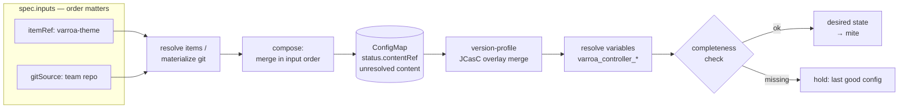

# Composed Bundles

<!-- sources: api/v1alpha1/types.go (ComposedBundle*), internal/bundle/composer.go, internal/bundle/resolver.go, internal/bundle/unresolved.go, internal/controller/catalog_controller.go (ReconcileComposedBundle) -->

A `ComposedBundle` is the unit of configuration a controller runs: an **ordered list of inputs** — catalog items and/or git bundle sources — merged into one CasC bundle. It is the seam between "teams own their config" and "platform owns the baseline": put the platform baseline first, team inputs after.

## Concepts: the composition pipeline

This page owns the authoritative statement of bundle composition; other pages link here.



1. **Resolve** — each input is fetched: `itemRef`s from [catalog items](casc-catalog.md) (local-first → operator-namespace fallback), `gitSource`s [materialized from git](bundle-sources.md) (SHA-cached), `ociSource`s materialized from OCI (digest-cached). Embedded `plugins:` blocks in jcasc items are split out to the plugin set here.
2. **Compose** — content merges **in input order**; later inputs win subject to `jcascMergeStrategy` (`errorOnConflict`, the default, fails composition on scalar conflicts; `override` lets later inputs replace). Any `authorizationStrategy` keys in JCasC content are **stripped** — Varroa owns authorization ([Jenkins RBAC](../security/jenkins-rbac.md)).
3. **Store unresolved** — the merged result is written to an owner-referenced ConfigMap named in `status.contentRef`, with variables **not yet substituted**, and fingerprinted as `status.resolvedHash`. One bundle, many controllers: per-controller values can't be baked in here.
4. **Overlay** — on the controller hot path, the matched [version profile](jenkins-versions.md)'s JCasC overlay is merged onto the composed `jenkins.yaml` — **before** variable resolution, so overlays may themselves use variables.
5. **Resolve variables** — `${…}` placeholders are substituted: composition-wide `spec.variables`, per-item `itemRef.variables` (highest precedence), and the Varroa-injected set below.
6. **Completeness check** — the final content is validated; an incomplete bundle (unresolved required variables, missing sections) **holds the controller on its last good configuration** rather than applying a broken one.

### Injected variables

| Variable | Value |
|---|---|
| `varroa_controller_name` | controller name |
| `varroa_controller_namespace` | controller namespace |
| `varroa_controller_endpoint` | in-cluster URL `http://<name>-<uid8>-svc.<ns>.svc.cluster.local:8080` |
| `varroa_controller_external_url` | the controller's external URL (per its ingress) |
| `varroa_controller_path_prefix` | path prefix in path-mode ingress, else empty |
| `varroa_frontend_url` | the dashboard URL |

Use them freely in any input — e.g. `unclassified.location.url: ${varroa_controller_external_url}`.

## How to create a composed bundle

```yaml
apiVersion: varroa.dev/v1alpha1
kind: ComposedBundle
metadata:
  name: platform-baseline
  namespace: teams-platform
spec:
  displayName: Platform baseline
  inputs:                                  # merge order: top to bottom
    - itemRef:
        name: varroa-theme                 # from the catalog
        variables: { org_name: acme }
    - gitSource:                           # the team's own bundle repo
        repoURL: https://github.com/example/casc-bundles.git
        path: bundles/team-platform
        revision: main
    - ociSource:                           # or an OCI artifact
        ref: ghcr.io/example/casc-bundles:v1
        path: bundles/team-platform
  variables:
    timezone: UTC                          # composition-wide, lower precedence than itemRef vars
  jcascMergeStrategy: errorOnConflict
```

```bash
kubectl apply -f bundle.yaml
```

Point a controller at it:

```yaml
spec:
  composedBundleRef:
    name: platform-baseline                # namespace defaults to the controller's own
```

### The built-in starter bundle

`composedBundleRef` is optional. A controller that omits it uses `varroa-starter`, a `ComposedBundle` the operator seeds into its own namespace from content embedded in the operator binary — a system message, a Kubernetes cloud, and one sample pipeline. Nothing is fetched, so this works on an air-gapped install exactly as it does on a connected one.

The starter exists so a first controller needs no git repository. It is not a base layer: naming any `composedBundleRef` replaces it entirely rather than merging over it.

The operator reconciles `varroa-starter` and its two `varroa.dev/starter=true` catalog items back into place every minute, so local edits do not survive — fork the content into your own bundle instead. Objects under those names that the operator did not create are left alone and logged, so an existing `varroa-starter` of your own is never overwritten.

**Verify:**

```bash
kubectl get composedbundle platform-baseline -n teams-platform \
  -o jsonpath='{.status.phase}{" "}{.status.resolvedHash}{"\n"}'
# Ready 4f8a…
kubectl get configmap -n teams-platform \
  $(kubectl get composedbundle platform-baseline -n teams-platform -o jsonpath='{.status.contentRef}') \
  -o jsonpath='{.data}' | head -c 300     # the merged, unresolved content
```

Editing `spec.inputs` bumps `metadata.generation`; the reconciler recomposes when `status.observedGeneration` lags, so input edits take effect without touching the underlying sources. The reconciler also re-resolves every `itemRef` on each tick and recomposes when a referenced `CatalogItem`'s `status.contentHash` changes — so a `CatalogSource` resync propagates into dependent bundles without editing the bundle itself, the same way git-input drift already did.

## Inspecting a bundle in the dashboard

The bundle detail workspace separates operational review into **Summary**, **Validation**, **Composition**, **Impact**, and collapsed **Diagnostics**. Composition keeps every input in spec order and shows its resolved namespace, revision, and `Resolved`, `Missing`, `Drifted`, or `Unknown` state. Validation contains bundle-level failures and remediation guidance; an `Invalid` bundle is not attributed to an individual input.

Impact lists only controllers whose cluster, effective bundle namespace, and bundle name all match. It also shows rollout waves and target-hash convergence. Diagnostics retains raw metadata and conditions for audit without obscuring the primary health view.

## Reference: status you'll actually read

| Field | Meaning |
|---|---|
| `status.phase` | `Pending` → `Ready`; `Invalid` (missing items / failed materialize / merge conflict); `Drifted` (pinned item changed upstream) |
| `status.resolvedHash` | sha256 of the merged (unresolved) content — the version controllers converge on and [waves](../operations/rollout-waves.md) gate |
| `status.contentRef` | owner-referenced ConfigMap with the merged content |
| `status.missingItems` / `driftedItems` | which itemRefs are broken / drifted |
| `status.errors` / `warnings` | materialize-time validation results |
| `status.inputSummary` | per-input kind/type/resolved-namespace, in order — mirrors `spec.inputs` for list views |

The BFF detail response additionally exposes top-level `resolvedInputs`. This is a display projection, not a CRD status field; its explicit indexes prevent sparse status data from shifting input identity.

## How to pause rollout of a bundle change

Annotate the bundle before pushing a risky change; controllers hold their last-good config until you resume:

```bash
kubectl annotate composedbundle platform-baseline -n teams-platform varroa.dev/rollout-paused=true
# ... push and verify the change on a canary, then:
kubectl annotate composedbundle platform-baseline -n teams-platform varroa.dev/rollout-paused-
```

**Verify:** while paused, affected controllers report `status.rollout.paused: true` and condition `RolloutPaused`. Staged rollout across controllers (canary waves) is covered in [Rollout waves](../operations/rollout-waves.md).

## Troubleshooting

- `Invalid`, merge conflict error → two inputs set the same scalar under `errorOnConflict`; reorder, remove the duplicate, or switch to `override` deliberately.
- Controller ignores a `Ready` bundle → completeness gate holding (unresolved `${var}`? check `status.warnings`), rollout paused, or wave-gated — see [Troubleshooting](../operations/troubleshooting.md).
- `authorizationStrategy` from your JCasC "disappears" → by design; define authorization via [Jenkins RBAC](../security/jenkins-rbac.md).

## Related pages

- [Bundle sources](bundle-sources.md) · [CasC catalog](casc-catalog.md) — the three input kinds
- [Jenkins versions](jenkins-versions.md) — the overlay merged in step 4
- [Rollout waves](../operations/rollout-waves.md) — staging a bundle change across the brood
- [Reconciliation](../operations/reconciliation.md) — when composed changes reach controllers
- [Pod & resource customization](pod-customization.md) — the pod/resource layering chain (the other layering contract)
