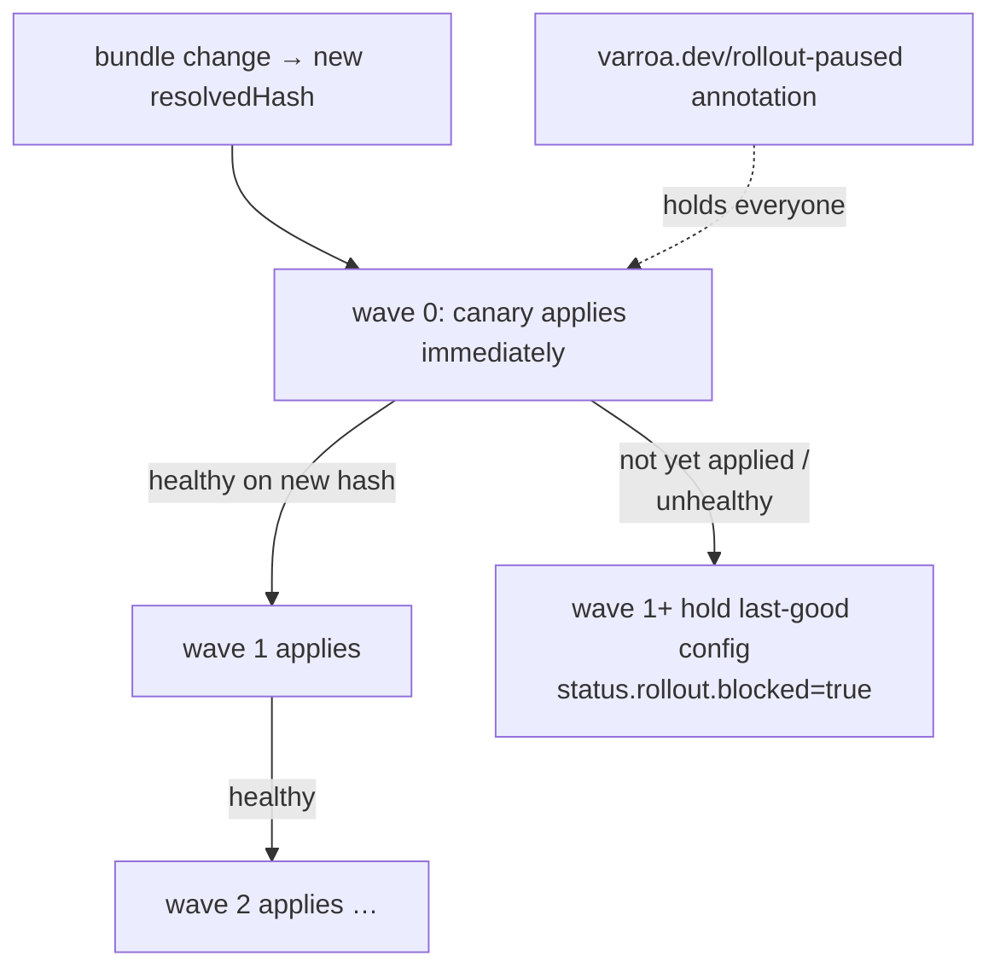

# Rollout Waves

<!-- sources: api/v1alpha1/types.go (ReconciliationPolicy.RolloutWave, RolloutStatus, ConditionRolloutPaused), internal/controller/wave_gate_test.go, internal/controller/controller_controller.go (waveGateCleared) -->

Progressive delivery for bundle changes: let a canary controller prove a new bundle version before the rest of the brood applies it. One integer per controller, one annotation per bundle — no pipelines required.

## Concepts: the wave gate

This page owns the authoritative statement of wave gating.

A controller's `spec.reconciliationPolicy.rolloutWave` (default `0`) orders bundle rollout among **controllers sharing the same [ComposedBundle](../config/composed-bundles.md)**:

> A controller applies a new bundle version (`status.resolvedHash`) only after **every `Connected` sibling on the same bundle with a strictly lower `rolloutWave`** has successfully applied **that same version**. Wave `0` has no earlier waves and applies immediately.

Notes that matter in practice:

- Only **Connected** siblings gate — a stopped or failed lower-wave controller doesn't block the brood forever; a *drifting-but-connected* one does (that's the point).
- Equal and higher waves never gate each other; controllers on *different* bundles never interact.
- While gated, the controller keeps running its **last good configuration** — the gate delays, it never breaks.
- The bundle-level annotation `varroa.dev/rollout-paused` holds **all** not-yet-converged controllers, wave 0 included ([pause how-to](../config/composed-bundles.md#how-to-pause-rollout-of-a-bundle-change)).



## How to set up a canary rollout

1. Pick a canary controller and leave it on wave `0`; put the brood behind it:

   ```bash
   kubectl patch controller canary -n teams-platform --type merge \
     -p '{"spec":{"reconciliationPolicy":{"rolloutWave":0}}}'
   for c in payments api web; do
     kubectl patch controller $c -n teams-platform --type merge \
       -p '{"spec":{"reconciliationPolicy":{"rolloutWave":1}}}'
   done
   ```

2. Push the bundle change (commit to the bundle repo / edit inputs). The canary applies; the rest report a blocked rollout.

3. **Verify the hold** while the canary bakes:

   ```bash
   kubectl get controller payments -n teams-platform -o jsonpath='{.status.rollout}' | jq .
   # {
   #   "targetBundleHash": "4f8a…",
   #   "blocked": true,
   #   "waitingOn": ["teams-platform/canary"],
   #   "blockedSince": "2026-07-04T02:10:00Z"
   # }
   ```

4. When the canary is healthy on the new hash, waves clear automatically — no action needed.

**Verify completion:** every controller's `status.rollout.blocked` is `false` (or the field is empty) and their applied hash matches the bundle's `status.resolvedHash`.

Deeper stacks work the same way: `0 → 1 → 2 → …` roll in order, each wave gated on all lower waves.

## How to stop a bad rollout

The canary went bad after wave 0 applied:

```bash
# 1. Freeze everyone else (wave 1+ are already holding, this also stops any stragglers):
kubectl annotate composedbundle platform-baseline -n teams-platform varroa.dev/rollout-paused=true

# 2. Fix: revert the bundle repo commit (or re-pin the input), let it recompose to a new hash.

# 3. Resume:
kubectl annotate composedbundle platform-baseline -n teams-platform varroa.dev/rollout-paused-
```

**Verify:** during the pause, held controllers show condition `RolloutPaused` (reason `RolloutPaused`) and `status.rollout.paused: true`; after resuming with the reverted hash, the brood converges on it wave by wave.

## Troubleshooting

- `blocked: true` and `waitingOn` names a controller that's off → the gate only counts Connected siblings; if it lists one, that sibling is Connected but hasn't applied the target hash — check *its* state (manual mode awaiting approval? failing to apply?).
- Everything blocked including wave 0 → the pause annotation is set; `blocked` with `paused: true` tells you which.
- Two controllers you expected to gate don't → different bundles (or different namespaces' same-named bundles) never interact.
- Waves cleared but a controller still didn't apply → its own [reconciliation mode](reconciliation.md) is `manual` — the gate opens the door, approval walks through it.

## Related pages

- [Composed bundles](../config/composed-bundles.md) — the hash being rolled out, and pausing
- [Reconciliation](reconciliation.md) — per-controller modes stack on top of the gate
- [Observability](observability.md) — watching a rollout in the activity feed
- [Brood operations](brood-operations.md) — bulk operations also use rolloutWave for ordering
