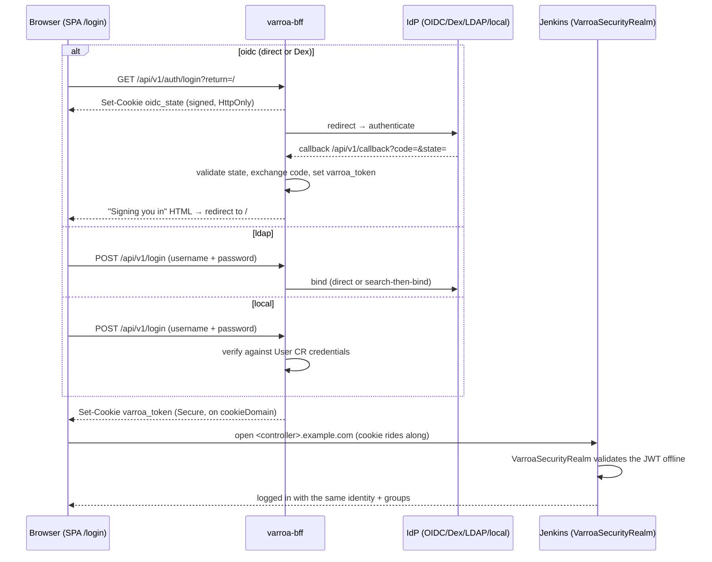

# Authentication

<!-- sources: cmd/bff/main.go (auth-mode flags, VARROA_LDAP_*), internal/auth/provider.go, internal/auth/ldap/, charts/varroa/values.yaml (auth.*, dex.*), charts/varroa/templates/bff/deployment.yaml, plugin/ -->

How people log in to Varroa — and how that same login carries into every Jenkins controller. Four modes, one decision, set at install time via `auth.mode`.

## Concepts: choosing a mode

| Mode | Identity lives in | Groups | Dex needed | Best for |
|---|---|---|---|---|
| `oidc` (direct) | Your OIDC provider (Auth0, Okta, Azure AD, Keycloak, Google, …) | From the `groups` claim | No | Production, any OIDC-compliant IdP |
| `oidc` (Dex-brokered) | GitHub OAuth / SAML / upstream LDAP, federated by Dex | Mapped by the Dex connector | Yes (bundled) | IdPs that don't speak OIDC natively |
| `ldap` | Your LDAP directory (BFF binds directly) | From LDAP group search | No | Directory shops that don't want a broker |
| `local` | `User` CRs in the cluster | Varroa-managed | No | Evaluation, air-gapped setups, break-glass |

Whatever the mode, the outcome is the same: the BFF issues a session as the `varroa_token` cookie on your `auth.cookieDomain`, [Varroa RBAC](varroa-rbac.md) authorizes API calls by user/group claims, and controller SSO works as described at the end of this page.

The dashboard's AuthContext exposes explicit phases:
| Phase | Display |
|---|---|
| `loadingConfig` | "Preparing secure sign-in" progress |
| `checkingSession` | "Checking your session" progress |
| `redirecting` | "Redirecting to sign in" progress |
| `callback` | "Signing you in" progress |
| `authenticated` | Protected content |
| `loggedOut` | Login page with explicit Sign in action |
| `error` | Login page with safe error and retry |

OIDC `loggedOut` never auto-starts authorization — the user must click Sign in. Local/LDAP modes skip the redirect/callback phases and show a credential form directly.



### The `varroa_token` cookie

Single sign-on across every controller works because one cookie is visible to all of them. That is a deliberate trade, so the attributes are worth stating explicitly:

| Attribute | Value | Why |
|---|---|---|
| `Domain` | `auth.cookieDomain` (e.g. `.example.com`) | The **parent** domain, so `app.example.com` and every `<controller>.example.com` see the same cookie. This is what removes per-controller redirect URIs. |
| `Secure` | always in `local` and `ldap` modes; in `oidc` mode, unless `auth.dashboardUrl` is an `http://` URL | The JWT is a bearer credential. There is no switch to turn this off — the BFF drops `Secure` only when the dashboard URL itself is plain HTTP, which is the local-development case. Browsers discard `Secure` cookies over plain HTTP, so a production `dashboardUrl` must be `https://`. |
| `HttpOnly` | always | JavaScript cannot read it, so an XSS in any page under the cookie domain cannot exfiltrate the token. |
| `SameSite` | `Lax` | Sends the cookie on top-level navigation between the dashboard and a controller — which is the flow — while withholding it from cross-site subrequests. |
| `Path` | `/` | Every path on every controller. |
| `Max-Age` | the issued token's lifetime in `local` and `ldap` modes; a fixed 24 hours in `oidc` mode | In OIDC mode this is a browser-session lifetime, **not** the provider's token lifetime — the JWT inside can expire sooner. Jenkins and the BFF both reject an expired token regardless of how long the cookie survives, so the effective session is whichever ends first. |

The scoping consequence is the one to weigh: **anything served under the cookie domain can receive the token on navigation.** Choose `cookieDomain` as narrowly as the deployment allows — `.varroa.example.com` rather than `.example.com` if the controllers live under a dedicated subdomain — and do not host untrusted content under it.

Jenkins does not trust the cookie's presence. `VarroaSecurityRealm` validates the JWT offline on every request: the signature and expiry always, and the issuer and audience whenever an issuer and client ID are configured — each fail-closed once configured. Configure both. Without them a signature-valid token minted for a different audience by the same provider is accepted, so leaving them unset widens what the realm will trust.

On logout, the BFF clears the `varroa_token` cookie, sets a five-minute `interactive_login` marker cookie (Path=/api/v1/auth), and returns JSON `{"redirect":"..."}` (no Location header). When the provider supports RP-initiated logout via `end_session_endpoint`, the redirect includes `id_token_hint` and `post_logout_redirect_uri`. The next explicit Sign in consumes the marker and requests `prompt=login&max_age=0` from the provider — providers that reject these parameters show a visible auth error instead of silently re-authenticating.

## How to configure direct OIDC

```yaml
# values-prod.yaml
auth:
  mode: oidc
  cookieDomain: .example.com
  dashboardUrl: https://app.example.com      # required in OIDC mode; used for post-logout redirect
  oidc:
    issuer: https://login.example.com/          # any RFC-compliant issuer
    clientId: varroa-dashboard
    clientSecret: "<client-secret>"
    redirectUrl: https://app.example.com/api/v1/callback
    # optional tuning (defaults shown):
    # scopes: openid,profile,email,groups
    # userClaim: preferred_username,sub
    # groupClaim: groups
dex:
  enabled: false
```

Register `https://app.example.com/api/v1/callback` as an allowed callback in your IdP, and make sure the IdP actually emits a groups claim (Auth0, for instance, needs an Action/rule to add one).

```bash
helm upgrade varroa charts/varroa -n varroa -f values-prod.yaml
```

**Verify:** log in at `https://app.example.com`, then:

```bash
curl -sf https://app.example.com/api/v1/me -H "Cookie: varroa_token=<value>" | jq '{user: .username, groups: .groups}'
```

Your user and expected groups appear — groups are what [role bindings](varroa-rbac.md) match on.

## RP-initiated logout and provider limitations

On logout, Varroa reads the ID token before clearing the `varroa_token` cookie, sets a five-minute `interactive_login` marker, and returns a JSON `{"redirect":"..."}` response. When the provider's [OIDC discovery document](https://openid.net/specs/openid-connect-discovery-1_0.html) advertises an `end_session_endpoint`, the BFF includes `id_token_hint` (the ID token read before clearing) and `post_logout_redirect_uri` (the dashboard URL + `/login`) in the redirect URL, sending the user to the provider's single-logout page.

Providers that **do not** support RP-initiated logout (no `end_session_endpoint`) simply redirect to `/login` where the SPA LoginPage awaits an explicit Sign in. The `interactive_login` marker ensures the next authorization request carries `prompt=login&max_age=0`, forcing credential re-entry. **Providers that ignore these standard parameters** will silently re-authenticate the user; this is a provider limitation documented here — Varroa requires explicit provider interaction but cannot dictate the factor. The logout itself always clears the Varroa session regardless of provider behavior.

The dashboard URL (`auth.dashboardUrl`) is required in OIDC mode as an absolute HTTPS origin (HTTP only for local development, e.g. `*.localtest.me`). It is validated at startup and used exclusively for `post_logout_redirect_uri`. Discovery capability changes (e.g. a provider adding or removing `end_session_endpoint`) require a BFF restart.

## State cookie security

Authorization uses a cryptographically random nonce paired with an HMAC-SHA256 signed `oidc_state` cookie (HttpOnly, Secure, SameSite=Lax, Path=/api/v1, five-minute lifetime). The cookie contains nonce, normalized return path, and expiry. The OAuth `state` parameter carries only the nonce. On callback, the BFF validates the signature (constant-time), nonce, and expiry, deletes the cookie (single-use), and redirects only to the validated return path. Cross-replica validation is supported via the shared `OIDC_STATE_SECRET` (32+ bytes) provisioned by Helm as a Kubernetes Secret (`<release>-oidc-state`) and preserved across upgrades.

## How to configure Dex-brokered login (GitHub example)

Use Dex when the upstream can't speak OIDC. Enable it and give it a connector; the BFF then treats **Dex** as its issuer (the chart defaults the issuer to Dex automatically when `dex.enabled=true` and no explicit `auth.oidc.issuer` is set):

```yaml
auth:
  mode: oidc
  cookieDomain: .example.com
  oidc:
    clientId: varroa
    clientSecret: "<dex-static-client-secret>"
    redirectUrl: https://app.example.com/api/v1/callback
dex:
  enabled: true
  config:
    connectors:
      - type: github
        id: github
        name: GitHub
        config:
          clientID: <github-oauth-app-id>
          clientSecret: <github-oauth-app-secret>
          redirectURI: https://dex.example.com/callback
          orgs: [{ name: example-org }]        # org teams become groups
```

The GitHub OAuth app's callback must be **Dex's** (`https://dex.example.com/callback`); Varroa's callback is registered as a static client inside Dex. An LDAP or SAML connector slots into the same `connectors:` list (the values file carries a commented LDAP connector example).

**Verify:** the login page bounces through GitHub; `/api/v1/me` shows `groups` like `example-org:team-name`.

## How to configure native LDAP

The BFF binds to your directory itself — no Dex hop, no OIDC issuer:

```yaml
auth:
  mode: ldap
  cookieDomain: .example.com
```

LDAP connection settings are flags/env on the BFF (`VARROA_LDAP_*`). The chart does not currently expose them as values, so patch them onto the BFF Deployment:

```bash
kubectl set env deploy/varroa-varroa-bff -n varroa \
  VARROA_LDAP_URL=ldaps://ldap.example.com:636 \
  VARROA_LDAP_USER_SEARCH_BASE="ou=people,dc=example,dc=com" \
  VARROA_LDAP_USER_SEARCH_FILTER="(uid=%s)" \
  VARROA_LDAP_GROUP_SEARCH_BASE="ou=groups,dc=example,dc=com" \
  VARROA_LDAP_SERVICE_ACCOUNT_DN="cn=varroa,ou=svc,dc=example,dc=com" \
  VARROA_LDAP_SERVICE_ACCOUNT_PASSWORD="<password>"
```

Two bind styles: **direct bind** (`VARROA_LDAP_BIND_DN_TEMPLATE`, e.g. `uid=%s,ou=people,dc=example,dc=com`) or **search-then-bind** (service account + user search, as above). `VARROA_LDAP_USER_EMAIL_ATTR` (default `mail`) and `VARROA_LDAP_USER_NAME_ATTR` (default `cn`) control profile mapping; LDAP groups become the user's groups for RBAC.

**Verify:** log in with a directory user; `/api/v1/me` shows the LDAP groups. (Note: a `kubectl set env` patch is re-flattened by the next `helm upgrade` — re-apply it, or bake it in with a post-render/kustomize step.)

## How to configure local auth

```yaml
auth:
  mode: local
  bffUrl: http://varroa-varroa-bff.varroa.svc.cluster.local:8080   # issuer URL for JWT validation
  cookieDomain: .example.com
  dashboardUrl: https://app.example.com
```

Users are `User` CRs with managed credentials — create them via the dashboard's admin area or the users API. Local mode is for evaluation and break-glass, not for broods of humans.

**Verify:** create a user, log in with it, `/api/v1/me` returns it.

## Concepts: how controller SSO works

Logging into Jenkins is not a second login. The `varroa_token` cookie is scoped to `auth.cookieDomain`, so the browser presents it to every controller host. Inside each Jenkins, the in-repo **VarroaSecurityRealm** plugin (delivered by init container, source under `plugin/`) validates the token **offline** against the issuer's public keys and establishes the same identity and groups — no per-controller OAuth clients, no Dex round trip at request time. The same plugin also verifies the [mite's operator-signed JWT](../architecture/mite.md); neither path uses Jenkins API tokens.

This is why `cookieDomain` must be the **parent** domain with a leading dot, and why every host on it needs TLS.

## Troubleshooting

- Login loop on the dashboard → redirect URL mismatch at the IdP, or missing TLS (Secure cookie dropped).
- Dashboard login works, Jenkins says anonymous → `cookieDomain` doesn't cover the controller host, or the security-realm plugin isn't active; see [Troubleshooting](../operations/troubleshooting.md).
- Groups empty in `/me` → IdP isn't emitting the groups claim, or `groupClaim` names the wrong claim.

## Related pages

- [Varroa RBAC](varroa-rbac.md) — what your groups let you do in Varroa
- [Jenkins RBAC](jenkins-rbac.md) — what they let you do inside Jenkins
- [API keys](api-keys.md) — create, rotate, and revoke non-browser credentials from the profile menu's dedicated API Keys page
- [Helm install](../install/helm-install.md) — where these values live
